#  Hi, I'm Ankit Pandey — PHP Developer

<div align="center">
  
</div>

<p align="center">
  <a href="https://github.com/ankit956151">
    
  </a>
  <a href="https://www.linkedin.com/in/ankit-pandey-1b0ba1215/">
    
  </a>
  <a href="https://x.com/Sit124A">
    
  </a>
  
</p>

---

##  About Me


I'm a passionate **PHP Developer** from **Mumbai, Maharashtra**, focused on creating dynamic web applications with clean, responsive design. I specialize in building CRUD applications, forum systems, and e-commerce solutions using modern web technologies.

- 🌍 Based in **Nalasopara East, Mumbai, Maharashtra**
- 🔭 Currently working on **Shopping Sites & Forum Systems**
- 🌱 Learning **Advanced PHP Frameworks & Database Optimization**
- 👯 Looking to collaborate on **E-commerce & Community Platforms**
- ⚡ Fun fact: **I love building UI designs and turning them into functional applications!**

### 🎯 Current Focus
```php
<?php
class AnkitPandey {
    public $name = "Ankit Pandey";
    public $location = "Mumbai, Maharashtra";
    public $role = "PHP Developer";
    
    public $techStack = [
        "frontend" => ["HTML5", "CSS3", "JavaScript", "jQuery", "Bootstrap"],
        "backend" => ["PHP", "MySQL"],
        "environment" => ["XAMPP", "Apache"],
        "tools" => ["Git", "GitHub"]
    ];
    
    public function getDailyRoutine() {
        return [
            "☕ Coffee",
            "💻 Code PHP applications", 
            "🎨 Design responsive UIs",
            "🔄 Practice CRUD operations"
        ];
    }
}
?>
```

---

##  Tech Stack & Tools

<div align="center">

### Core Technologies
<p>
  
</p>

### Development Environment
<p>
  
  
</p>

</div>

<details>
<summary><b>🛠️ Detailed Tech Stack</b></summary>

| Category | Technologies |
|----------|-------------|
| **Backend** |   |
| **Frontend** |      |
| **Development** |   |
| **Version Control** |   |

</details>

---

##  Featured Projects

<div align="center">

### 🚀 My Recent Work

</div>

<table>
<tr>
<td width="50%">

### 🛒 Shopping Site
**E-commerce Platform**

```javascript
// Tech Stack
const project = {
    language: "JavaScript",
    frontend: ["HTML5", "CSS3", "jQuery"],
    features: [
        "🛍️ Product catalog",
        "🛒 Shopping cart functionality", 
        "💳 Checkout system",
        "📱 Bootstrap responsive design"
    ]
};
```

**Technologies:** `JavaScript` `jQuery` `HTML5` `CSS3` `Bootstrap`  
[🔗 View Repository](https://github.com/ankit956151/Shopping_site)

</td>
<td width="50%">

### 💬 Forum System
**Community Discussion Platform**

```php
// Key Features  
$features = [
    "👥 User registration & login",
    "📝 Post creation & replies", 
    "🔍 Topic categorization",
    "⭐ User interactions"
];
```

**Technologies:** `PHP` `MySQL` `HTML5` `CSS3` `Bootstrap`  
[🔗 View Repository](https://github.com/ankit956151/forum)

</td>
</tr>
</table>

<div align="center">

### 📊 CRUD Operations System
**Database Management Application**

*Complete Create, Read, Update, Delete functionality with PHP and MySQL*  
**Features:** Data validation • Secure queries • User-friendly interface  
[🔗 View Repository](https://github.com/ankit956151/crud-using-php)

### 🏪 Grocery Store UI & Homepage Designs
**Responsive Web Interfaces**

*Clean, modern UI designs for grocery store and homepage layouts*  
**Technologies:** HTML5 • CSS3 • Bootstrap • Responsive Design  
[🔗 Grocery Store UI](https://github.com/ankit956151/grocery-store-ui) | [🔗 Homepage Design](https://github.com/ankit956151/homepage-ui-design)

</div>

---

##  GitHub Analytics

<div align="center">
  


</div>

<div align="center">
  
[](https://git.io/streak-stats)

</div>

### 📊 Contribution Activity
[](https://github.com/ankit956151)

---

##  Development Approach

<div align="center">



</div>

```mermaid
graph LR
    A[💡 Plan & Design] --> B[🎨 Create UI]
    B --> C[⚙️ Build Backend]
    C --> D[🗄️ Database Setup]
    D --> E[🧪 Test & Debug]
    E --> F[🚀 Deploy]
    F --> A
```

### 🎯 My Development Philosophy
- **🎨 UI-First Approach:** Design clean, responsive interfaces before coding
- **🔧 CRUD Mastery:** Focus on solid database operations and data management
- **📱 Responsive Design:** Ensure applications work seamlessly across all devices  
- **🔒 Clean Code:** Write maintainable, well-structured PHP code
- **🧪 Practical Learning:** Build real projects to strengthen skills
- **🌱 Continuous Growth:** Always learning new techniques and best practices

---

##  Let's Connect

<div align="center">

[](https://github.com/ankit956151)
[](https://www.linkedin.com/in/ankit-pandey-1b0ba1215/)
[](https://x.com/Sit124A)
[](mailto:ankit.pandey01409@gmail.com)

### 📍 Location: Mumbai, Maharashtra, India

</div>

### 💼 What I'm Looking For
- 🚀 **Web Development Projects** - E-commerce sites, forums, CMS systems
- 💡 **PHP Development Opportunities** - Backend development and database design
- 🤝 **Collaboration** - Open to working on interesting web applications
- 🌟 **Learning Opportunities** - Always eager to work with new technologies

---

<div align="center">

### 🌟 Thanks for visiting my profile! 


**💬 Let's build something amazing together! Feel free to explore my repositories and reach out for collaboration.**

### 🔥 Recent Activity
```php
echo "Currently working on: Shopping sites, Forum systems, and UI designs";
echo "Next goal: Advanced PHP frameworks and API development";
```


</div>
